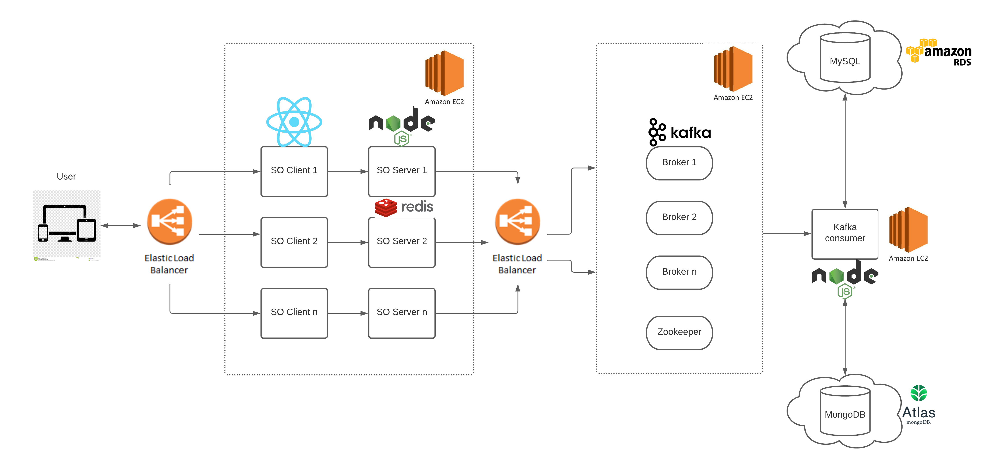

# Stack Overflow Web App

This project is a full-stack replica of everyone's favorite debugging companion, powered by a modern microservices architecture using MERN stack with Kafka-powered message handling and Redis-accelerated responses.


## Table of Contents
- [Features](#features)
- [Tech Stack](#tech-stack)
- [Architecture](#architecture)
- [Quick Start](#quick-start)
- [Development Guide](#development-guide)
- [Contributing](#contributing)

## Features

- **User Authentication**: Secure login/signup with JWT superpowers
- **Question Management**: Post, edit, and moderate questions with markdown pizzazz ✍️
- **Answer System**: Help others while farming those sweet reputation points
- **Tag Organization**: Because taxonomies make everything better
- **Developer Chats**: Slide into DMs, developer style
- **Reputation & Badges**: Virtual bling for your debugging prowess
- **Admin Analytics**: Because someone needs to keep the lights on
- **Search Sorcery**: Find needles in code haystacks

## Tech Stack

### Frontend Wonderland
- **React**: Building UIs like LEGO blocks
- **Redux**: State management that sparks joy
- **Material UI**: Making things pretty without crying
- **React Router**: Navigation that just works

### Backend Circus
- **Node.js/Express**: The ringmaster of API show
- **Kafka**: Message broker extraordinaire
- **MongoDB**: For questions that don't fit in rows
- **MySQL**: When relationships matter
- **Redis**: Making fast things faster

## Architecture

The system implements a microservices architecture with three core components, each designed for specific responsibilities:



### Frontend

Handles user interface rendering and state management through React components, providing intuitive access to Q&A functionality.
```
frontend/
├── public/          
├── src/
│   ├── Components/  
│   ├── auth/        
│   └── uploads/
└── ...      
```

### Backend

Manages API endpoints, business logic, and data validation while coordinating with Kafka for asynchronous operations.
```
backend/
├── config/
├── controllers/    
├── kafka/          
├── loaders/       
├── models/         
├── services/       
├── test/ 
└── ...      
```

### Kafka

Handles asynchronous communication between services, ensuring reliable message delivery and processing.
```
kafka/
├── config/
├── consumers/     
├── loaders/        
├── models/         
├── services/
└── ...   
```

The architecture emphasizes:

- Service isolation through microservices

- Event-driven message processing

- Polyglot persistence with MongoDB and MySQL

- Distributed caching via Redis

- Secure authentication flows

This microservices approach enables independent scaling, maintainability, and resilience while supporting the complex interactions required for a Q&A platform.

## Quick Start

### Prerequisites
- Node.js 
- MySQL 
- MongoDB 
- Redis 
- Kafka 
- Upgrade dependencies
- A sense of adventure

### Installation

1. **Clone the Repository**
```bash
git clone https://github.com/rohanbpatel14/stackoverflow-webapp-clone.git
cd stackoverflow-webapp-clone
```

2. **Setup Databases**
```bash
# MySQL
mysql -u root -p
CREATE DATABASE stackoverflow;

# MongoDB
# Make sure MongoDB is running
```

3. **Configure Environment**
```bash
# Backend
ENV="your_env"
PORT=8080

# Kafka (.env)
SECRET_KEY="your_secret_key"

# Frontend
REACT_APP_API=http://localhost:8080/api
```

4. **Install Dependencies & Start Services**
```bash
# Frontend
cd frontend
npm install
npm start

# Backend
cd backend
npm install
npm start

# Kafka
cd kafka
npm install
npm start
```

## Development Guide

### Git Branch Naming
```
feature/add-question-voting
bugfix/fix-auth-token
enhancement/improve-search
```

### Code Style
```javascript
// DO: Clear, descriptive names
const fetchUserQuestions = async (userId) => {
  // Implementation
}

// DON'T: Cryptic shortcuts
const getUQ = async (uid) => {
  // Mystery code
}
```

## Contributing

1. Fork it (Fork it real good)
2. Create your feature branch (`git checkout -b feature/amazing-feature`)
3. Commit your changes (`git commit -m 'Add something amazing'`)
4. Push to the branch (`git push origin feature/amazing-feature`)
5. Open a Pull Request

---

Built with ❤️, ☕, and too many console.log statements to count.